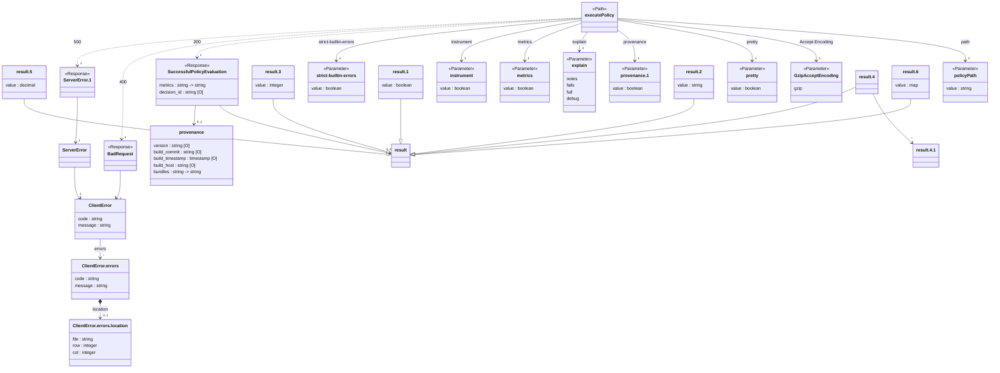
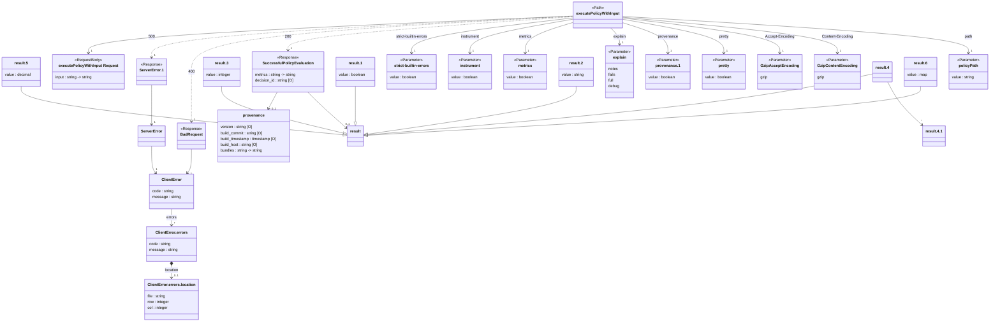
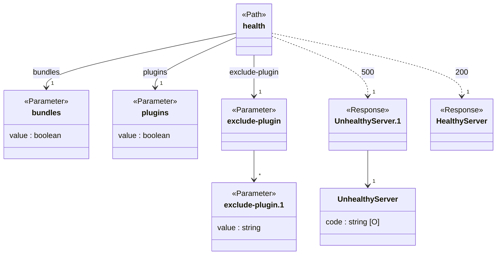

# Opa SDK


## Overview

Enterprise OPA documentation
<https://docs.styra.com/enterprise-opa>
### Available Operations

* [executePolicy](#executepolicy) - Execute a policy
* [executePolicyWithInput](#executepolicywithinput) - Execute a policy given an input
* [health](#health) - Verify the server is operational

## executePolicy

Execute a policy



### Example Usage

```java
package hello.world;

import com.styra.opa.models.operations.*;
import com.styra.opa.models.operations.ExecutePolicyRequest;
import com.styra.opa.models.operations.ExecutePolicyResponse;
import com.styra.opa.models.shared.*;
import com.styra.opa.models.shared.Explain;
import com.styra.opa.models.shared.GzipAcceptEncoding;
import com.styra.opa.opa;
import java.math.BigDecimal;
import java.math.BigInteger;
import java.time.LocalDate;
import java.time.OffsetDateTime;
import java.util.Optional;
import static java.util.Map.entry;

public class Application {

    public static void main(String[] args) {
        try {
            Opa sdk = Opa.builder()
                .build();

            ExecutePolicyRequest req = ExecutePolicyRequest.builder()
                .path("<value>")
                .acceptEncoding(GzipAcceptEncoding.GZIP)
                .pretty(false)
                .provenance(false)
                .explain(Explain.NOTES)
                .metrics(false)
                .instrument(false)
                .strictBuiltinErrors(false)
                .build();

            ExecutePolicyResponse res = sdk.executePolicy()
                .request(req)
                .call();

            if (res.successfulPolicyEvaluation().isPresent()) {
                // handle response
            }
        } catch (com.styra.opa.models.errors.SDKError e) {
            // handle exception
        } catch (Exception e) {
            // handle exception
        }
    }
}
```

### Parameters

| Parameter                                                                                               | Type                                                                                                    | Required                                                                                                | Description                                                                                             |
| ------------------------------------------------------------------------------------------------------- | ------------------------------------------------------------------------------------------------------- | ------------------------------------------------------------------------------------------------------- | ------------------------------------------------------------------------------------------------------- |
| `request`                                                                                               | [com.styra.opa.models.operations.ExecutePolicyRequest](../../models/operations/ExecutePolicyRequest.md) | :heavy_check_mark:                                                                                      | The request object to use for the request.                                                              |


### Response

**[Optional<? extends com.styra.opa.models.operations.ExecutePolicyResponse>](../../models/operations/ExecutePolicyResponse.md)**
### Errors

| Error Object          | Status Code           | Content Type          |
| --------------------- | --------------------- | --------------------- |
| models/errorsSDKError | 4xx-5xx               | */*                   |

## executePolicyWithInput

Execute a policy given an input



### Example Usage

```java
package hello.world;

import com.styra.opa.models.operations.*;
import com.styra.opa.models.operations.ExecutePolicyWithInputRequest;
import com.styra.opa.models.operations.ExecutePolicyWithInputRequestBody;
import com.styra.opa.models.operations.ExecutePolicyWithInputResponse;
import com.styra.opa.models.shared.*;
import com.styra.opa.models.shared.Explain;
import com.styra.opa.models.shared.GzipAcceptEncoding;
import com.styra.opa.models.shared.GzipContentEncoding;
import com.styra.opa.opa;
import java.math.BigDecimal;
import java.math.BigInteger;
import java.time.LocalDate;
import java.time.OffsetDateTime;
import java.util.Optional;
import static java.util.Map.entry;

public class Application {

    public static void main(String[] args) {
        try {
            Opa sdk = Opa.builder()
                .build();

            ExecutePolicyWithInputRequest req = ExecutePolicyWithInputRequest.builder()
                .path("<value>")
                .requestBody(ExecutePolicyWithInputRequestBody.builder()
                        .input(java.util.Map.ofEntries(
                                entry("key", "<value>")))
                        .build())
                .contentEncoding(GzipContentEncoding.GZIP)
                .acceptEncoding(GzipAcceptEncoding.GZIP)
                .pretty(false)
                .provenance(false)
                .explain(Explain.NOTES)
                .metrics(false)
                .instrument(false)
                .strictBuiltinErrors(false)
                .build();

            ExecutePolicyWithInputResponse res = sdk.executePolicyWithInput()
                .request(req)
                .call();

            if (res.successfulPolicyEvaluation().isPresent()) {
                // handle response
            }
        } catch (com.styra.opa.models.errors.SDKError e) {
            // handle exception
        } catch (Exception e) {
            // handle exception
        }
    }
}
```

### Parameters

| Parameter                                                                                                                 | Type                                                                                                                      | Required                                                                                                                  | Description                                                                                                               |
| ------------------------------------------------------------------------------------------------------------------------- | ------------------------------------------------------------------------------------------------------------------------- | ------------------------------------------------------------------------------------------------------------------------- | ------------------------------------------------------------------------------------------------------------------------- |
| `request`                                                                                                                 | [com.styra.opa.models.operations.ExecutePolicyWithInputRequest](../../models/operations/ExecutePolicyWithInputRequest.md) | :heavy_check_mark:                                                                                                        | The request object to use for the request.                                                                                |


### Response

**[Optional<? extends com.styra.opa.models.operations.ExecutePolicyWithInputResponse>](../../models/operations/ExecutePolicyWithInputResponse.md)**
### Errors

| Error Object          | Status Code           | Content Type          |
| --------------------- | --------------------- | --------------------- |
| models/errorsSDKError | 4xx-5xx               | */*                   |

## health

The health API endpoint executes a simple built-in policy query to verify that the server is operational. Optionally it can account for bundle activation as well (useful for “ready” checks at startup).



### Example Usage

```java
package hello.world;

import com.styra.opa.models.operations.*;
import com.styra.opa.models.operations.HealthRequest;
import com.styra.opa.models.operations.HealthResponse;
import com.styra.opa.models.shared.*;
import com.styra.opa.opa;
import java.math.BigDecimal;
import java.math.BigInteger;
import java.time.LocalDate;
import java.time.OffsetDateTime;
import java.util.Optional;
import static java.util.Map.entry;

public class Application {

    public static void main(String[] args) {
        try {
            Opa sdk = Opa.builder()
                .build();

            HealthResponse res = sdk.health()
                .bundles(false)
                .plugins(false)
                .excludePlugin(java.util.List.of(
                    "<value>"))
                .call();

            if (res.healthyServer().isPresent()) {
                // handle response
            }
        } catch (com.styra.opa.models.errors.SDKError e) {
            // handle exception
        } catch (Exception e) {
            // handle exception
        }
    }
}
```

### Parameters

| Parameter                                                                                                                                                                                                                                                                     | Type                                                                                                                                                                                                                                                                          | Required                                                                                                                                                                                                                                                                      | Description                                                                                                                                                                                                                                                                   |
| ----------------------------------------------------------------------------------------------------------------------------------------------------------------------------------------------------------------------------------------------------------------------------- | ----------------------------------------------------------------------------------------------------------------------------------------------------------------------------------------------------------------------------------------------------------------------------- | ----------------------------------------------------------------------------------------------------------------------------------------------------------------------------------------------------------------------------------------------------------------------------- | ----------------------------------------------------------------------------------------------------------------------------------------------------------------------------------------------------------------------------------------------------------------------------- |
| `bundles`                                                                                                                                                                                                                                                                     | *Optional<? extends Boolean>*                                                                                                                                                                                                                                                 | :heavy_minus_sign:                                                                                                                                                                                                                                                            | Boolean parameter to account for bundle activation status in response. This includes any discovery bundles or bundles defined in the loaded discovery configuration.                                                                                                          |
| `plugins`                                                                                                                                                                                                                                                                     | *Optional<? extends Boolean>*                                                                                                                                                                                                                                                 | :heavy_minus_sign:                                                                                                                                                                                                                                                            | Boolean parameter to account for plugin status in response.                                                                                                                                                                                                                   |
| `excludePlugin`                                                                                                                                                                                                                                                               | List<*String*>                                                                                                                                                                                                                                                                | :heavy_minus_sign:                                                                                                                                                                                                                                                            | String parameter to exclude a plugin from status checks. Can be added multiple times. Does nothing if plugins is not true. This parameter is useful for special use cases where a plugin depends on the server being fully initialized before it can fully initialize itself. |


### Response

**[Optional<? extends com.styra.opa.models.operations.HealthResponse>](../../models/operations/HealthResponse.md)**
### Errors

| Error Object          | Status Code           | Content Type          |
| --------------------- | --------------------- | --------------------- |
| models/errorsSDKError | 4xx-5xx               | */*                   |
